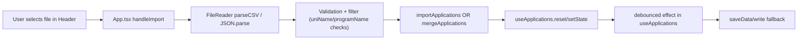
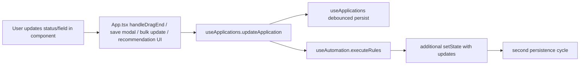
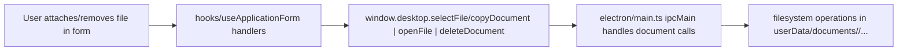
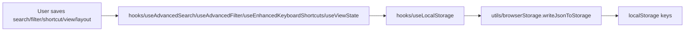
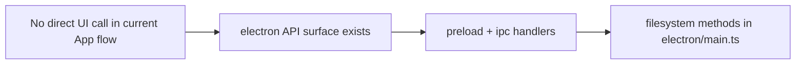

# Call-Chain Map: User Action → Persistence

This file maps user interactions to their persistence outcomes in AcademiaTrack.

## Legend

- **App/UI**: component event handler in renderer layer (`components/`, `App.tsx`, `contexts/`).
- **State Hook**: domain hook that mutates in-memory state (`hooks/`).
- **Normalizer**: migration/schema step before write (`utils/dataMigration.ts`).
- **Writer**: runtime persistence adapter (`electron` IPC or `localStorage`).

## 1) Create or Edit Application

```mermaid
flowchart LR
U[User edits form in ApplicationModal / QuickCapture] --> C["App.tsx handleSave"]
C --> S1["hooks/useApplications.addApplication/updateApplication"]
S1 --> U1["useUndoRedo.setState"]
U1 --> D1["useApplications debounced effect"]
D1 --> N1["dataMigration.wrapInSchema"]
N1 --> W1["window.desktop.saveData"]:::ipc
W1 --> M1["electron/main.ts ipcMain.handle('saveData')"]
M1 --> F1["write data.json to userData (temp + rename)"]
```

### Variants

- Quick-capture path: `App.tsx` -> `handleSave` -> `addApplication` in the same chain.
- Duplicate path: `hooks/useApplicationForm.ts` or action menu -> `useApplications.duplicateApplication` -> same persistence chain.

## 2) Import Data (CSV/JSON)

- CSV import uses `hooks/useApplications.mergeApplications`.
- JSON import uses `hooks/useApplications.importApplications`.
- On parse error, no save call is emitted.

## 3) Status and Field Updates

- Automation rule execution in `hooks/useAutomation.ts` can create a second update pass.
- Undo/Redo in `App.tsx` modifies state in `hooks/useUndoRedo` and therefore also follows the same persistence effect.

## 4) Document Attach/Remove (Desktop-only)

- `handleAttachFile` and `handleAttachEssayDraftFile` call `window.desktop.copyDocument`.
- `handleOpenFile` and `handleOpenEssayDraftFile` call `window.desktop.openFile`.
- `handleRemoveFile` and `handleRemoveEssayDraftFile` call `window.desktop.deleteDocument`.
- File paths are stored in app documents fields and therefore persist through the normal application save chain.

## 5) Search, Filter, and Command Preference Persistence

Key keys and owners:

- `phd-applications` -> `hooks/useApplications.ts` full app data schema
- `saved-searches`, `search-history` -> `hooks/useAdvancedSearch.ts`
- `saved-filters` -> `hooks/useAdvancedFilter.ts`
- `custom-themes`, `active-theme-id`, `font-size`, `font-family`, `view-density` -> `hooks/useThemeCustomization.ts`
- `kanban-custom-statuses`, `kanban-status-config` -> `hooks/useKanbanConfig.ts`
- `application-templates` -> `hooks/useTemplates.ts`
- `view-states`, `view-presets` -> `hooks/useViewState.ts`
- `custom-field-definitions` -> `hooks/useCustomFields.ts`
- `custom-keyboard-shortcuts`, `keyboard-shortcuts-enabled` -> `hooks/useEnhancedKeyboardShortcuts.ts`
- `automation-rules`, `automation-logs` -> `hooks/useAutomation.ts`
- `academiatrack-search-index` -> `utils/searchIndex.ts` metadata only

## 6) Backup and Update Runtime APIs

- `createBackup`, `listBackups`, `restoreBackup`, `deleteBackup`, `autoBackup` are implemented in `electron/main.ts` and exposed in `preload.ts`.
- Current renderer code path does not consistently invoke backup/update APIs, so these are available surface area rather than active call chains.

## 7) One-Loop Data Freshness Rule

- Loader path:
  - `hooks/useApplications` mounts, calls `window.desktop.loadData` (desktop) or `readJsonFromStorage('phd-applications')` (web), then `migrateData`.
  - All edits route through `useUndoRedo`, then persist through debounced `saveData`.
- All application mutations with durable state are expected to reach this writer path unless they are temporary UI state (e.g., selected filters in memory).
