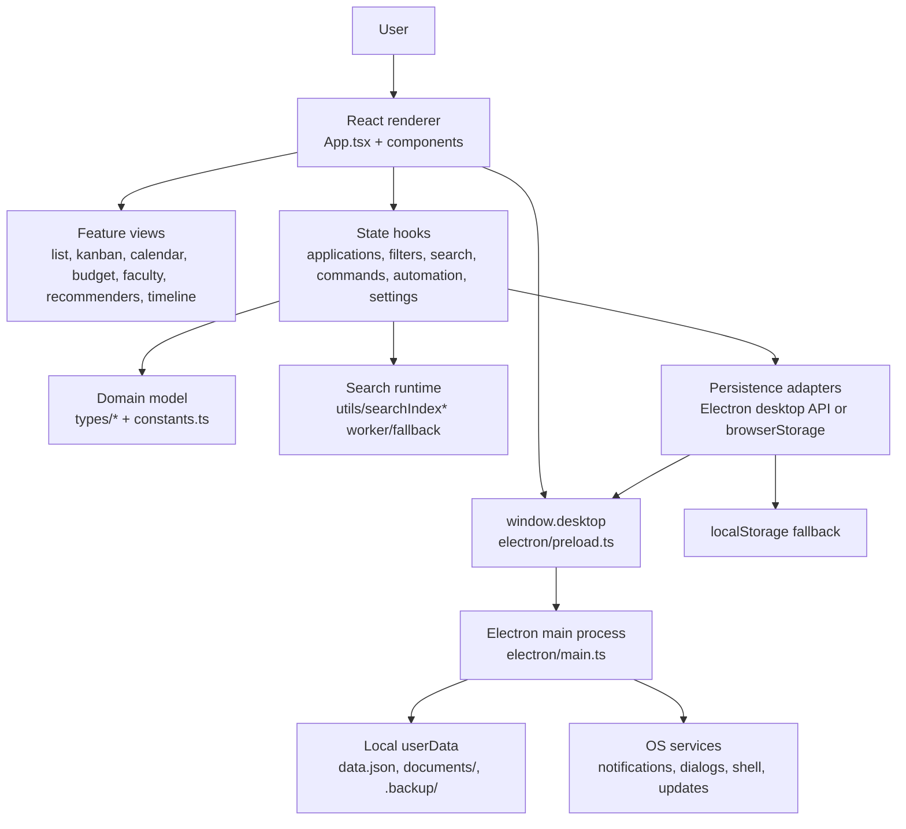
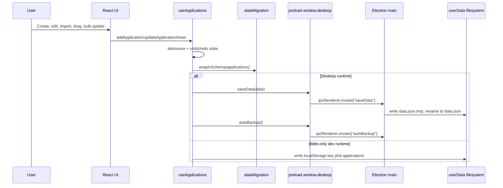
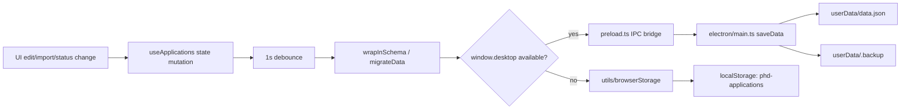

# AcademiaTrack

AcademiaTrack is a desktop-first academic application tracker for managing universities, programs, deadlines, documents, faculty contacts, recommenders, budgets, timelines, and application status. The app is built with React and Vite in the renderer, Electron for the desktop shell, and local filesystem persistence for desktop data.

<p align="center">
  
</p>

## What It Does

- Tracks applications across list, kanban, calendar, budget, faculty, recommender, comparison, and timeline views.
- Persists application data locally through Electron IPC, with browser `localStorage` fallback for web-only development.
- Supports document attachment, local file opening, automatic backups, deadline notifications, imports, exports, custom fields, saved filters, saved searches, automation rules, templates, and keyboard-driven commands.
- Uses a worker-backed search index when available, with synchronous search fallback.

## App Features

### Application Tracking

- Full application records for university, program, department, location, rankings, R1 status, deadline, preferred deadline, decision deadline, admission term/year, portal link, status, tags, pinned state, admission chance, and notes.
- Status lifecycle tracking across not-started, in-progress, submitted, interview, accepted, rejected, and waitlisted workflows.
- Document checklist tracking for CV, statement of purpose, transcripts, three recommendation letters, and writing samples, including required flags, document status, submitted dates, and desktop file paths.
- Test tracking for GRE and English-language requirements, including status and optional cost fields.
- Essay tracking with multiple drafts, version numbers, word counts, notes, final-draft selection, and optional desktop file attachments.
- Reminder tracking per application, with completion state and date metadata.

### Views And Workflows

- List view with sorting, search, optional visible-column configuration, bulk selection, duplicate/edit/delete actions, and filtered empty states.
- Kanban board with drag-and-drop status updates, configurable columns, custom statuses, status ordering, and status color configuration.
- Calendar and timeline views for deadline-oriented planning.
- Budget view for application fees, fee waivers, financial offers, scholarships, stipend details, tuition waivers, health insurance, assistantships, and total spending.
- Faculty view for advisor outreach, interview prep, research-fit notes, papers read, fit scores, correspondence, and contact status.
- Recommenders view for recommender ownership, request/submission dates, relationship context, and per-application recommender status.
- Comparison workflow for reviewing selected applications side by side.
- Quick capture modal for fast application entry before filling the full record.

### Search, Filters, And Commands

- Basic search and sorting for everyday list navigation.
- Advanced search with saved searches and search history.
- Advanced filter builder with nested boolean logic, field-specific conditions, saved filters, and persisted filter presets.
- Worker-backed full-text search index through `utils/searchIndexWrapper.ts`, with fallback to the synchronous index when workers are unavailable.
- Command palette and keyboard routing through a central command registry.
- Custom keyboard shortcuts and shortcut enablement settings through `hooks/useEnhancedKeyboardShortcuts.ts`.

### Power-User Tools

- Bulk operations for selected applications, including status changes, field updates, document status changes, tag management, deletion, and comparison.
- Configurable export modal with field categories, selected-field export, saved export presets, and CSV, JSON, Markdown, and browser-print PDF output.
- Application templates with built-in PhD CS and funded master's defaults, custom template creation, template updates, usage counts, and create-from-application support.
- Custom field definitions for text, number, boolean, date, select, and calculated fields, with visibility and ordering controls.
- View state and view preset persistence for per-view sort/filter/search/column preferences.
- Data validation panel for required fields, stale deadline warnings, submitted-document checks, URL checks, admission-chance ranges, fee ranges, duplicate detection, and completeness scoring.
- Advanced analytics for status distribution, program-type distribution, acceptance rate, average time to decision, average fee, total spent, average admission chance, urgent/upcoming deadlines, status trends, and acceptance forecasting.
- Workflow automation rules with triggers for application creation, status changes, and field updates; condition matching; actions for reminders, status/field updates, tag add/remove; and execution logs.
- Theme customization for custom themes, active theme, font size, font family, and view density.

### Desktop Capabilities

- Electron shell with custom title bar, native window controls, secure preload bridge, desktop dialogs, notifications, shell file opening, and update APIs.
- Local document management through `selectFile`, `copyDocument`, `openFile`, and `deleteDocument` IPC calls.
- Atomic desktop saves through temp-file write and rename in `electron/main.ts`.
- Backup APIs for create, list, restore, delete, and automatic backup.
- Renderer-only development remains usable through browser storage fallbacks where desktop APIs are unavailable.

## Project Diagram



## Runtime Flow



## Repository Map

```text
.
|-- App.tsx                    # top-level app state, modal wiring, command setup
|-- index.tsx                  # React mount and error boundary
|-- components/                # feature views, modals, cards, shell UI
|-- hooks/                     # state, persistence, filtering, commands, automation
|-- contexts/                  # command registry context
|-- electron/                  # Electron main/preload process and desktop IPC
|-- lib/desktopBridge.ts       # desktop API compatibility aliasing
|-- types/                     # application, automation, command, enum types
|-- utils/                     # migration, search, storage, export, format helpers
|-- src/data/                  # static university reference data
|-- tests/e2e/                 # Playwright desktop tests
|-- graphify-out/              # generated knowledge graph artifacts
|-- COMMUNITY_MAP_SUBSYSTEM.md # subsystem ownership map
|-- CALL_CHAIN_PERSISTENCE.md  # user action to persistence map
|-- OWNERSHIP_INVENTORY.md     # file ownership inventory
```

## Main Subsystems

| Area | Primary Files | Notes |
| --- | --- | --- |
| App shell | `App.tsx`, `index.tsx`, `components/MainContent.tsx`, `components/Header.tsx`, `components/TitleBar.tsx` | Owns top-level composition, selected view, modal orchestration, and desktop chrome. |
| Feature UI | `components/*View.tsx`, `components/ApplicationModal.tsx`, `components/ApplicationCard/*` | Renders application workflows and domain-specific panels. |
| State hooks | `hooks/useApplications.ts`, `hooks/useAppModals.ts`, `hooks/useAutomation.ts`, `hooks/useViewState.ts` | Owns app data state, automation, view preferences, and UI state. |
| Persistence | `hooks/useApplications.ts`, `utils/dataMigration.ts`, `utils/browserStorage.ts`, `electron/main.ts`, `electron/preload.ts` | Loads, migrates, saves, backs up, imports, and exports local data. |
| Search and filtering | `hooks/useSortAndFilter.ts`, `hooks/useAdvancedSearch.ts`, `hooks/useAdvancedFilter.ts`, `utils/searchIndex*` | Provides baseline filters, saved searches, advanced filters, and indexed search. |
| Commanding | `contexts/CommandContext.tsx`, `hooks/useAppCommands.ts`, `components/CommandPalette.tsx`, `hooks/useEnhancedKeyboardShortcuts.ts` | Registers actions, keyboard shortcuts, and command palette entries. |
| Power tools | `components/BulkOperationsModal.tsx`, `components/ExportConfigModal.tsx`, `hooks/useTemplates.ts`, `hooks/useCustomFields.ts`, `hooks/useViewState.ts` | Owns bulk edits, selected-field exports, templates, custom fields, and persisted view layouts. |
| Validation and analytics | `components/DataValidationPanel.tsx`, `components/AdvancedAnalyticsPanel.tsx`, `hooks/useDataValidation.ts`, `hooks/useAdvancedAnalytics.ts` | Computes data quality, completeness, duplicate groups, application metrics, trends, and forecasts. |
| Automation and customization | `hooks/useAutomation.ts`, `components/AutomationRulesModal.tsx`, `components/AutomationRuleBuilder.tsx`, `hooks/useKanbanConfig.ts`, `hooks/useThemeCustomization.ts` | Owns rule-based updates, automation logs, custom kanban status config, and visual preferences. |
| Types | `types/interfaces.ts`, `types/enums.ts`, `types/automation.ts`, `types/commands.ts` | Defines the durable application model and cross-layer contracts. |
| Tests and tooling | `vitest.config.ts`, `playwright.config.ts`, `tests/`, `components/__tests__/`, `hooks/__tests__/` | Unit, integration, and desktop E2E test setup. |

## Data and Persistence Details

Desktop data is stored under Electron's `app.getPath("userData")`:

- `data.json` stores the versioned application schema.
- `documents/<applicationId>/` stores copied document attachments.
- `.backup/` stores backups created by the Electron backup APIs.

The main data path is:



Preference-like state uses local storage keys owned by the matching hooks, including `saved-searches`, `search-history`, `saved-filters`, `custom-themes`, `view-states`, `view-presets`, `custom-field-definitions`, `custom-keyboard-shortcuts`, `automation-rules`, and `application-templates`.

Additional persisted UI/runtime keys include `active-theme-id`, `font-size`, `font-family`, `view-density`, `keyboard-shortcuts-enabled`, `kanban-custom-statuses`, `kanban-status-config`, `export-presets`, `automation-logs`, `auto-save-enabled`, `deadline-notifications-enabled`, and `academiatrack-search-index`.

## Prerequisites

- Node.js `>=20 <26`
- npm v10 or newer
- A desktop environment capable of running Electron

This repo uses the native TypeScript 7 beta compiler through `tsgo` for typechecking and Electron compilation. It also keeps the TypeScript 6 compatibility package installed for tools that still expect the JavaScript `typescript` API.

## Install

```bash
npm install
```

## Run In Development

Desktop development:

```bash
npm run dev:electron
```

This starts Vite on `http://localhost:3000`, waits for that server, compiles `electron/main.ts` into `dist-electron/`, and launches Electron.

Renderer-only development:

```bash
npm run dev
```

Use renderer-only mode when you only need the web UI. Desktop-only APIs fall back where supported, but file attachment, native dialogs, backups, notifications, updates, and window controls require Electron.

## Build And Package

Build the Vite renderer:

```bash
npm run build
```

Compile Electron and package the desktop app:

```bash
npm run build:electron
```

`electron-builder` writes packaged artifacts to `release/`. The configured targets are NSIS on Windows, DMG on macOS, and AppImage on Linux.

## Verification

Typecheck both renderer and Electron projects:

```bash
npm run typecheck
```

Run unit and integration tests:

```bash
npm run test:run
```

Run Vitest in watch mode:

```bash
npm test
```

Run the map coverage check after ownership-boundary edits:

```bash
npm run map:verify
```

## Knowledge Graph And Code Maps

This repo includes two code navigation layers:

- Graphify generated graph artifacts under `graphify-out/`.
- GitNexus generated index artifacts under `.gitnexus/`.

It also includes deterministic code maps at the repository root:

- `graphify-out/GRAPH_REPORT.md` - graph freshness, communities, god nodes, and navigation hints.
- `graphify-out/FILE_INDEX.md` - fast subsystem-to-file lookup.
- `graphify-out/GRAPH_TREE.html` - collapsible file-tree view.
- `graphify-out/graph.html` - interactive graph.
- `graphify-out/graph.json` - graph query data.
- `.gitnexus/` - GitNexus repository index.
- `COMMUNITY_MAP_SUBSYSTEM.md` - subsystem ownership map.
- `OWNERSHIP_INVENTORY.md` - file-by-file ownership index.
- `CALL_CHAIN_PERSISTENCE.md` - user-action to persistence path map.

When changing architecture or ownership boundaries, start with GitNexus status plus the community and ownership maps, then verify with:

```bash
npm run map:status
```

If GitNexus artifacts are stale after code changes, refresh GitNexus and verify static map coverage:

```bash
npm run map:refresh
```

If Graphify graph content is stale, rebuild it with the `/graphify . --update` skill workflow. The installed `graphify` shell CLI supports graph queries and hook management, but does not expose `graphify update`.

Individual commands are also available:

```bash
npm run gitnexus:status
npm run gitnexus:analyze
npm run gitnexus:wiki
npm run graphify:hook-status
npm run map:verify
```

## Important Implementation Notes

- `vite.config.ts` serves development builds on port `3000` and uses `@/*` as an alias to the repo root.
- Electron runs with `contextIsolation: true`, `nodeIntegration: false`, and `sandbox: true`; renderer code should use `window.desktop` instead of Node APIs.
- `electron/preload.ts` exposes both `window.desktop` and `window.electron` for compatibility.
- `utils/dataMigration.ts` is the migration boundary for durable application schema changes.
- `hooks/useApplications.ts` owns load/save, migration, deadline notifications, undo/redo integration, auto-backup calls, import, export, duplicate, and merge behavior.
- Search lives in `utils/searchIndex.ts`, `utils/searchIndex.worker.ts`, `utils/searchIndexWorker.ts`, and `utils/searchIndexWrapper.ts`.

## Core Technologies

- React 19
- Electron 41
- Vite 6
- TypeScript native preview / `tsgo`
- Tailwind CSS 4
- Framer Motion
- Vitest
- Playwright
- Recharts
